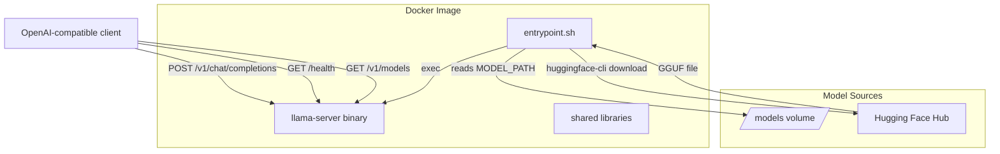
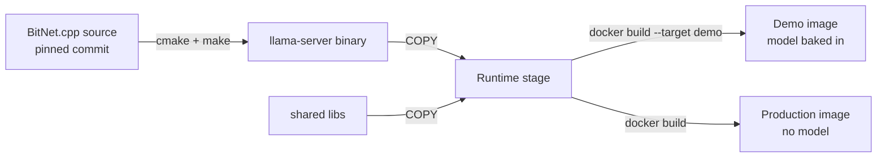
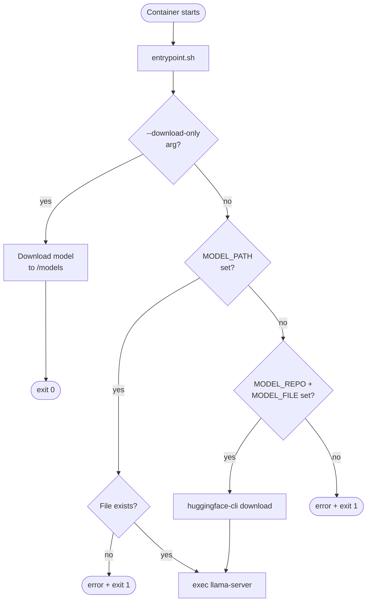

# Design Document — bitnet-openai-proxy

## Overview

`bitnet-openai-proxy` packages [BitNet.cpp](https://github.com/microsoft/BitNet) into a Docker container that exposes an OpenAI-compatible REST API. The design is intentionally thin: the C++ `llama-server` binary (shipped by BitNet.cpp, which is itself built on the llama.cpp ecosystem) already implements the OpenAI Chat Completions protocol. The project's job is to:

1. Compile `llama-server` reproducibly inside a multi-stage Docker build.
2. Wrap it with a shell entrypoint that handles model loading (local path or Hugging Face download) and maps environment variables to `llama-server` CLI flags.
3. Publish two image variants — **demo** (model baked in) and **production** (model loaded at runtime) — via a GitHub Actions CI/CD pipeline to GHCR.

There is no Python layer, no reverse proxy, and no additional HTTP server. The only inference process is `llama-server`.

---

## Architecture



### Build-time flow



### Runtime flow



---

## Components and Interfaces

### 1. Dockerfile

A single `Dockerfile` with two named stages and one optional build target.

**Builder stage** (`builder`):
- Base: `ubuntu:22.04`
- Build arguments:
  - `BITNET_COMMIT` — Git commit SHA of BitNet.cpp (defaults to the commit pinned in the Git submodule at `3rdparty/BitNet`)
  - `CMAKE_EXTRA_FLAGS` — additional CMake flags (default: `-DBITNET_X86_TL2=OFF` for the portable i2_s quantization path)
- Steps:
  1. Install build dependencies (cmake ≥ 3.22, clang-18, git, python3, pip).
  2. Clone `estebanjosse/BitNet` at `BITNET_COMMIT` and run `git submodule update --init --recursive` to populate the nested `llama.cpp` submodule. A full git clone is required — a plain `COPY` of the submodule directory has no `.git` metadata and cannot initialise nested submodules.
  3. Install `gguf-py` (bundled inside the cloned repo at `3rdparty/llama.cpp/gguf-py`) — required by BitNet's codegen scripts.
  4. Copy a pretuned kernel header to `include/bitnet-lut-kernels.h`. BitNet's `ggml-bitnet-lut.cpp` unconditionally includes this header at compile time regardless of cmake flags; it must exist before cmake runs. The preset for `bitnet_b1_58-3B` (also used by `BitNet-b1.58-2B-4T`) is used as a generic baseline. The header's symbols are only called at runtime when `GGML_BITNET_X86_TL2` or `GGML_BITNET_ARM_TL1` is defined.
  5. Run `cmake` with `CMAKE_EXTRA_FLAGS` and build the `llama-server` target.
- **Submodule strategy**: The builder always clones from GitHub at the pinned `BITNET_COMMIT`. The local `3rdparty/BitNet` submodule in the repository serves only as a reference for the default commit SHA; it is not copied into the Docker build context.

**Runtime stage** (`runtime`):
- Base: `ubuntu:22.04` (minimal, no build tools)
- Copies `llama-server` binary and required shared libraries from `builder`.
- Installs only runtime dependencies: `libstdc++6`, `libgomp1`, `curl`, `python3`, `pip` (for `huggingface-hub` CLI).
- **Python usage**: Python is **not** required for inference itself (the `llama-server` binary is pure C++ and runs standalone). Python is included only for the `huggingface-cli` tool, which downloads models from Hugging Face at container startup. The inference process (`llama-server`) runs without any Python layer.
- `EXPOSE 8080`
- `ENTRYPOINT ["/entrypoint.sh"]`

**Demo target** (`demo`):
- Extends the runtime stage with an additional `RUN` that downloads the default GGUF model into `/models/` at build time.
- Sets `ENV MODEL_PATH=/models/<default-model-file>` so the entrypoint uses it without any user-supplied env vars.
- Built with `docker build --target demo`.

**Build argument documentation** (Dockerfile comments):
```
# BITNET_COMMIT: Git commit SHA to clone from estebanjosse/BitNet.
#                Defaults to the commit pinned in the 3rdparty/BitNet submodule.
#                Override with --build-arg BITNET_COMMIT=<sha> to test a specific commit.
#
# CMAKE_EXTRA_FLAGS examples:
# x86-64 i2_s (default):  --build-arg CMAKE_EXTRA_FLAGS="-DBITNET_X86_TL2=OFF"
# x86-64 TL2 kernels:     --build-arg CMAKE_EXTRA_FLAGS="-DBITNET_X86_TL2=ON"
# ARM64 TL1 kernels:      --platform linux/arm64 --build-arg CMAKE_EXTRA_FLAGS="-DBITNET_ARM_TL1=ON"
```

### 2. entrypoint.sh

A POSIX shell script (`#!/bin/sh`) that is the container `ENTRYPOINT`.

**Responsibilities:**
- Parse the optional `--download-only` argument.
- Resolve the model path (from `MODEL_PATH` or by downloading from Hugging Face).
- Validate that the resolved model file exists.
- Build the `llama-server` command line from environment variables.
- `exec llama-server` (replacing the shell process).

**Environment variable → llama-server flag mapping:**

| Env var | llama-server flag | Default |
|---|---|---|
| `MODEL_PATH` | `--model` | — |
| `SERVER_HOST` | `--host` | `0.0.0.0` |
| `SERVER_PORT` | `--port` | `8080` |
| `CTX_SIZE` | `--ctx-size` | `2048` |
| `N_THREADS` | `--threads` | *(omitted — auto-detect)* |
| `N_PARALLEL` | `--parallel` | `1` |
| `LOG_LEVEL` | `--log-level` | `info` |

**Hugging Face download:**
```sh
huggingface-cli download "$MODEL_REPO" "$MODEL_FILE" \
    --local-dir /models \
    ${HF_TOKEN:+--token "$HF_TOKEN"}
```
The resolved path becomes `/models/$MODEL_FILE`.

### 3. GitHub Actions CI/CD Workflow

A single workflow file `.github/workflows/ci.yml` with three trigger paths:

| Trigger | Jobs |
|---|---|
| Push to `main` | build-production, build-demo, smoke-test, push-ghcr |
| Version tag `vX.Y.Z` | build-production, build-demo, smoke-test, push-ghcr (semver tags) |
| Pull request | build-production, build-demo (no push) |

**Key actions used:**
- `docker/setup-buildx-action` — enables BuildKit
- `docker/login-action` — authenticates to GHCR with `GITHUB_TOKEN`
- `docker/metadata-action` — generates tags from Git ref
- `docker/build-push-action` — builds and optionally pushes

**Smoke-test job:**
1. Start the production container with a small test GGUF model mounted via `MODEL_PATH`.
2. Poll `GET /health` every 5 seconds, up to 60 seconds total; fail if no HTTP 200.
3. Send `POST /v1/chat/completions` with a minimal valid payload; assert HTTP 200.
4. Stop the container.

**Tag generation logic** (handled by `docker/metadata-action` flavors):

| Git event | Production tags | Demo tags |
|---|---|---|
| Push to `main` | `latest`, `main-<sha7>` | `latest-demo`, `main-<sha7>-demo` |
| Tag `v1.2.3` | `1.2.3`, `1.2`, `1`, `latest` | `1.2.3-demo`, `1.2-demo`, `1-demo`, `latest-demo` |
| Pull request #42 | `pr-42` *(not pushed)* | `pr-42-demo` *(not pushed)* |

---

## Data Models

### Environment variable contract

All configuration is passed to the container via environment variables. There is no config file format.

```
MODEL_PATH     string   Absolute path to GGUF file inside container
MODEL_REPO     string   Hugging Face repo ID (e.g. "microsoft/bitnet-b1.58-2B-4T-gguf")
MODEL_FILE     string   Filename within MODEL_REPO (e.g. "ggml-model-i2_s.gguf")
HF_TOKEN       string   Hugging Face access token (optional)
SERVER_HOST    string   Bind address (default: "0.0.0.0")
SERVER_PORT    uint16   Listen port (default: 8080)
CTX_SIZE       uint32   Context window in tokens (default: 2048)
N_THREADS      uint32   CPU thread count (default: omitted → auto)
N_PARALLEL     uint32   Concurrent inference slots (default: 1)
LOG_LEVEL      enum     "debug" | "info" | "warn" | "error" (default: "info")
```

### OpenAI Chat Completions request (subset handled by llama-server)

```json
{
  "model": "string",
  "messages": [
    { "role": "system|user|assistant", "content": "string" }
  ],
  "temperature": 0.0,
  "max_tokens": 256,
  "stream": false
}
```

### OpenAI Chat Completions response

```json
{
  "id": "chatcmpl-...",
  "object": "chat.completion",
  "created": 1234567890,
  "model": "string",
  "choices": [
    {
      "index": 0,
      "message": { "role": "assistant", "content": "string" },
      "finish_reason": "stop"
    }
  ],
  "usage": {
    "prompt_tokens": 10,
    "completion_tokens": 20,
    "total_tokens": 30
  }
}
```

### Docker image build arguments

```
BITNET_COMMIT      string   Git commit SHA to clone from estebanjosse/BitNet (defaults to 3rdparty/BitNet submodule commit)
CMAKE_EXTRA_FLAGS  string   Additional CMake flags (default: "-DBITNET_X86_TL2=OFF")
```

### Git submodule

The repository includes a Git submodule at `3rdparty/BitNet` pointing to `https://github.com/estebanjosse/BitNet`. The submodule is pinned to a tested commit and provides the default value for `BITNET_COMMIT` when building the Docker image. This ensures reproducible builds without requiring users to specify a commit SHA manually.

---

## Correctness Properties

*A property is a characteristic or behavior that should hold true across all valid executions of a system — essentially, a formal statement about what the system should do. Properties serve as the bridge between human-readable specifications and machine-verifiable correctness guarantees.*

The entrypoint script contains the only custom logic in this project (the Dockerfile and CI workflow are declarative configuration). The testable properties are concentrated in the entrypoint's argument-forwarding and error-handling logic.

### Property 1: Server flags are forwarded for any env var combination

*For any* combination of `SERVER_HOST`, `SERVER_PORT`, `CTX_SIZE`, `N_PARALLEL`, and `LOG_LEVEL` values, the `llama-server` command constructed by the entrypoint script SHALL contain each flag (`--host`, `--port`, `--ctx-size`, `--parallel`, `--log-level`) with its corresponding value.

**Validates: Requirements 2.7**

### Property 2: Non-existent MODEL_PATH always produces a non-zero exit

*For any* string value assigned to `MODEL_PATH` that does not correspond to an existing file, the entrypoint script SHALL exit with a non-zero exit code and print an error message to stderr.

**Validates: Requirements 2.6**

### Property 3: Semver tag expansion is correct for any valid version

*For any* version tag of the form `vX.Y.Z` (where X, Y, Z are non-negative integers), the tag generation logic SHALL produce exactly the set `{X.Y.Z, X.Y, X, latest}` for the production image and `{X.Y.Z-demo, X.Y-demo, X-demo, latest-demo}` for the demo image, with no additional or missing tags.

**Validates: Requirements 7.4**

---

## Error Handling

### Entrypoint script errors

| Condition | Behaviour |
|---|---|
| Neither `MODEL_PATH` nor (`MODEL_REPO` + `MODEL_FILE`) set | Print error to stderr, `exit 1` |
| `MODEL_PATH` set but file does not exist | Print error to stderr, `exit 1` |
| `huggingface-cli download` fails | The command's non-zero exit propagates; script exits non-zero (relies on `set -e`) |
| `llama-server` exits unexpectedly | Exit code propagates to Docker (container stops with that code) |

The script MUST run with `set -e` (exit on first error) and `set -u` (treat unset variables as errors, except for optional env vars which use `${VAR:-default}` syntax).

### CI pipeline errors

| Condition | Behaviour |
|---|---|
| Docker build fails | Workflow step fails; subsequent steps (smoke-test, push) are skipped |
| Smoke-test health-check times out (> 60 s) | Workflow marked failed; push step does not run |
| Smoke-test HTTP assertion fails | Workflow marked failed; push step does not run |
| GHCR push fails | Workflow marked failed |

The push step MUST be conditioned on `needs.smoke-test.result == 'success'` to prevent publishing broken images.

### llama-server errors (delegated)

HTTP error handling for the REST API (400 for invalid JSON, etc.) is fully delegated to `llama-server`. The entrypoint does not intercept or transform HTTP traffic.

---

## Testing Strategy

### Overview

This project is primarily composed of:
- A **Dockerfile** (declarative, no custom logic)
- A **shell script** (custom logic: branching, argument construction, error handling)
- A **GitHub Actions workflow** (declarative CI configuration)

Property-based testing applies to the entrypoint shell script's argument-forwarding and error-handling logic. All other components are verified through smoke tests (static inspection) and integration tests (running the container).

### Unit / Property tests — entrypoint.sh

The entrypoint script logic is tested by sourcing or invoking it in a controlled environment with mocked dependencies (`llama-server`, `huggingface-cli`).

**Property-based testing library:** [Bats](https://github.com/bats-core/bats-core) for shell script testing, combined with a simple shell-based property runner that generates random inputs.

**Property 1 test** — `Feature: bitnet-openai-proxy, Property 1: Server flags are forwarded for any env var combination`
- Generate random values for SERVER_HOST (random IP/hostname), SERVER_PORT (random valid port), CTX_SIZE (random positive integer), N_PARALLEL (random positive integer), LOG_LEVEL (random from enum).
- Invoke the entrypoint with a mock `llama-server` that captures its arguments.
- Assert the captured arguments contain each expected flag-value pair.
- Run minimum 2 iterations.

**Property 2 test** — `Feature: bitnet-openai-proxy, Property 2: Non-existent MODEL_PATH always produces a non-zero exit`
- Generate random strings that are not valid filesystem paths (or paths guaranteed not to exist).
- Set `MODEL_PATH` to each generated value and invoke the entrypoint.
- Assert exit code is non-zero and stderr contains an error message.
- Run minimum 2 iterations.

**Property 3 test** — `Feature: bitnet-openai-proxy, Property 3: Semver tag expansion is correct for any valid version`
- Generate random non-negative integers X, Y, Z.
- Run the tag generation logic (extracted as a pure shell function or tested via the metadata-action equivalent).
- Assert the output tag set equals `{X.Y.Z, X.Y, X, latest}` for production and `{X.Y.Z-demo, X.Y-demo, X-demo, latest-demo}` for demo.
- Run minimum 10 iterations.

**Example-based unit tests:**
- `MODEL_PATH` set → `llama-server` invoked with `--model <path>`
- `MODEL_REPO` + `MODEL_FILE` set → `huggingface-cli download` called with correct args
- `HF_TOKEN` set → `--token` flag present in download command
- `HF_TOKEN` not set → `--token` flag absent
- `--download-only` arg → `llama-server` not invoked, exit 0
- `N_THREADS` not set → `--threads` flag absent from `llama-server` invocation
- Default values: SERVER_HOST=`0.0.0.0`, SERVER_PORT=`8080`, CTX_SIZE=`2048`, N_PARALLEL=`1`, LOG_LEVEL=`info`

**Edge case tests:**
- No model env vars set → exit 1 with error message
- `MODEL_PATH` set to empty string → exit 1 with error message

### Smoke tests — Dockerfile and CI workflow (static inspection)

These tests inspect the source files without running containers:
- Dockerfile declares `ARG BITNET_COMMIT` and uses it in the `git checkout` command.
- Dockerfile declares `ARG CMAKE_EXTRA_FLAGS` with default `-DBITNET_AVX2=ON`.
- Dockerfile runtime stage `FROM` is `ubuntu:22.04`.
- Dockerfile has `EXPOSE 8080`.
- Dockerfile demo target sets `ENV MODEL_PATH`.
- CI workflow builds both variants on push to `main`.
- CI workflow push step is conditioned on smoke-test success.
- CI workflow uses `GITHUB_TOKEN` for GHCR login.
- CI workflow health-check loop has a 60-second timeout.

### Integration tests — running containers

These tests require a running container with a real (small) GGUF model:
- `GET /health` returns HTTP 200 when server is ready.
- `GET /v1/models` returns valid OpenAI models JSON.
- `POST /v1/chat/completions` with a valid payload returns HTTP 200 and a valid OpenAI response body.
- `POST /v1/chat/completions` with an invalid JSON body returns HTTP 400.
- Demo image starts with no env vars and serves requests successfully.

Integration tests are run as part of the CI smoke-test job. They are not run in the unit test suite (no container required for unit tests).
